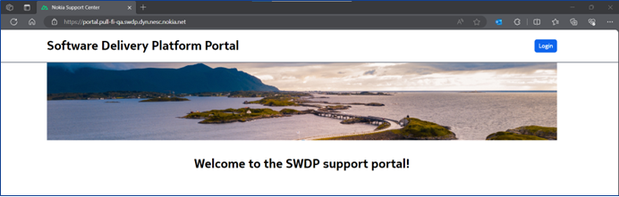
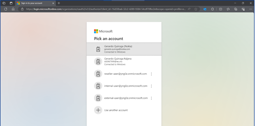
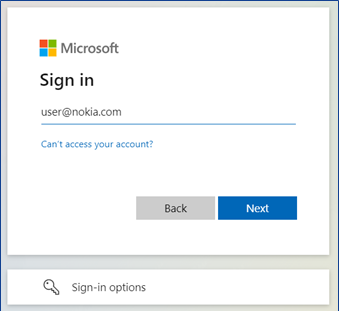

= Access Token management

To access the SWDP download site via CLI, you will need a Personal Access Token (PAT). 

Authentication to the SWDP download site is done using the username PAT and a generated access token.

The access token is generated and managed either using a dedicated service under the SWDP web GUI or using dedicated SWDP download site endpoint(s). The access token is decrypted on the SWDP side, and credentials are checked against Nokia users Active Directory.

Credentials must be passed via HTTP Basic Authentication (HTTP Header Authorization containing base64-encoded credentials). 

== 1.1	Access token management using CLI

This section explains how to generate or revoke an access token using CLI.

=== 1.1.1	Prerequisite

Ensure that you have access to the Nokia Support Portal. The registration guide to the Nokia Support Portal is available on the portal website.
For SWDP token generation, you need to specify the same credentials (email address and password) that you use to access the Nokia Support Portal.

=== 1.1.2	Generating an access token

. To generate the access token, run the command below:

curl <hostname>/api/v1/token/create -u <email address> -X POST
The -u option is used to specify your Nokia Support Portal email address for authentication.

•	You are prompted to enter a password. 

.. Enter the same password you use to access Nokia Support Portal.

The token is valid for 3 months, after which the user must generate a new token.

Example:

curl https://swdp-pull-fi.swdp.dyn.nesc.nokia.net/api/v1/token/create -u john.smith@example.com -X POST

IMPORTANT:

Token generation is limited to 20 requests per minute per IP address. Whenever the limit is reached, error 429 is displayed. 

CAUTION:

DO NOT ENTER THE PASSWORD DIRECTLY INTO THE COMMAND LINE!

The password should be always provided via the prompt. With this approach, it is ensured the password is not left in any bash history.

=== 1.1.3	Revoking the access token 

When you no longer need a token, you can revoke it. 

==== 1.1.3.1	Revoke only one token

To revoke only one specific token, run the command below using the value PAT (personal access token) as username. When prompted for a password, the revoked token must be used:

curl <hostname>/api/v1/token/revoke -u PAT -X POST

Once the command is run, the token will be removed. 

=== 1.1.3.2	Revoke all tokens for a given authentication username (user mail, country code, end user id)

To revoke all tokens related to a specific authentication username, run the curl command shown below. When prompted for a password, the user password in LDAP must be used:

curl <hostname>/api/v1/token/revoke/all -u <email address> -X POST

This will remove all tokens of the given authentication username.

==1.2	Access   token management using SWDP Portal (Availability to be announced later)

This section will cover how to generate a token, view or delete a token using the SWDP Portal. 

SWDP Portal offers two web portal URLs to create access tokens:

•	To create tokens for a customer located in the United States, use: https://portal.pull-us.swdp.dyn.nesc.nokia.net/

•	To create tokens for a non-US customer, use: https://portal.swdp-pull-fin.swdp.dyn.nesc.nokia.net/

.SWDP Portal Landing Page.

== 1.2.1	Logging in to SWDP Portal 

On the SWDP Portal,

. click the Login button at the top-right corner. 

. Pick your account from the list shown, or 

. Click the Use another account button to sign in with a different email and password.

=== 1.2.1.1	Pick an Account

If you see your credentials in the displayed list, click on it:

.Accounts are available when logged in.

Once you click your account, you will be logged in.

=== 1.2.1.2	Use Another Account

If you do not see your account, click the Use another account button, then type your email:

.Sign in window

Then type your password:

ⓘ	If logging in for the first time, then a pop-up window is displayed asking you to grant access. Click Accept to grant access.

ⓘ	After 1 hour of inactivity, if you click on any element, you will be automatically redirected to the login page.

 
1.2.2	Managing access tokens using SWDP Portal
In this section you will be guided on how to navigate the SWDP Portal to create, delete and view token(s).

1.2.2.1	Access Tokens
After you have logged into the SWDP Portal, you will see the landing page. Click the Access Tokens button:

You will see the Token Management Page. From here, you can generate, delete and view your token(s):

1.2.2.2	Generating a token
1.	To create a token, click the Generate Token button. 
A new pop-up window will appear, asking you to provide a name to your token. 
•	Type a unique name meeting the following criteria:
•	Starts and ends with an alphanumeric character.
•	Does not contain any other characters.
o	Max 64 characters.
o	May contain alphanumeric characters or hyphens.
NOTE: Country code and Customer ID will be automatically populated and are not editable.

After Typing the name, click the Submit button.

2.	The next pop-up window will contain the token. 

⚠	Make sure to copy it now and store it in a safe place. It will not be shown to you again.
3.	After you copy your token, click the Close button.
4.	You will see your previous and recently created token names.

1.2.2.2	Delete Tokens
There are two options for deleting tokens: 
•	Select one or more tokens to delete individually, or  
•	Delete all your tokens at once.

To delete one or multiple tokens, click the checkbox next to each token's name, then click the Delete selected button. A confirmation message displays. Click Yes to delete the selected tokens.

If you want to delete all tokens at once, click the Delete all button. You will be prompted to confirm your choice to delete all your access tokens. Click Yes to delete all tokens.

1.2.2.3	Expiration of a token
If you have any token(s) that are about to expire, you will receive an email notification with the information from each token. If you still need the token(s), make sure to create new ones on the SWDP Portal.
ⓘ	Email notification is set to two weeks, one week, one day and the day of expiration of the token. Expired tokens get deleted once the last notification is sent on day of expiration.

